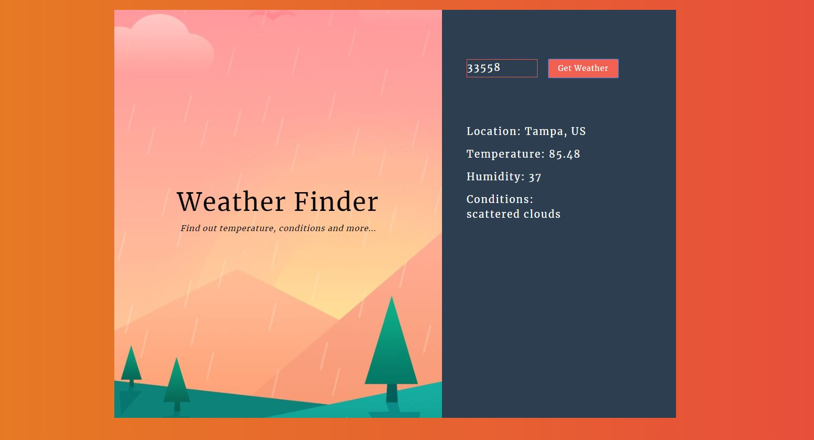

# Simple Weather App
A simple weather application built with react.js 
Click on thumbnail to watch demo

# Deployed Link
https://nmsuri28.github.io/simpleweatherapp/

# Installation 

> npm create-react-app "app-name"

# Other technology used
Weather Api: 
https://openweathermap.org/api
# Usage
Please read the documentation for usage: 
React: 
https://facebook.github.io/create-react-app/docs/getting-started
 
Weather Api: https://openweathermap.org/current

# Credit
Followed along with this tutorial:
https://youtu.be/204C9yNeOYI

# Contact Me:
Natosha[@creativeHotMess](https://twitter.com/creativeHotMess) | https://www.linkedin.com/in/natosha-martin-676263165